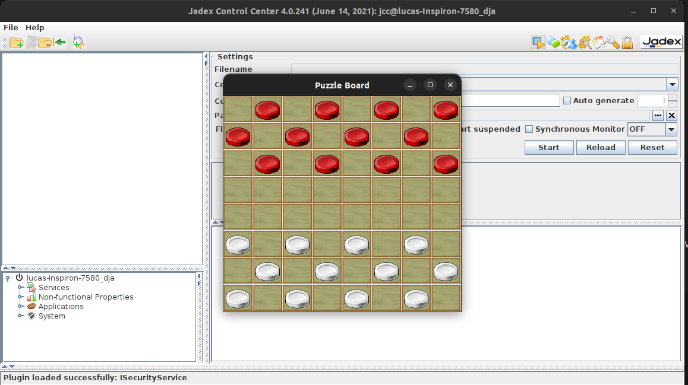
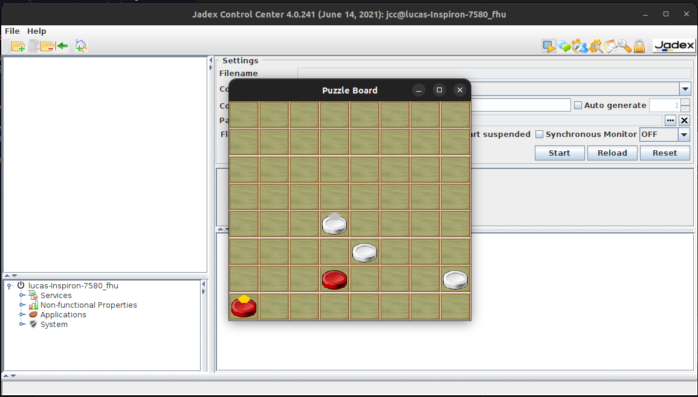

# Planning com damas

**Disciplina**: FGA0134 - Sistemas Multiagentes <br>
**Nro do Grupo (de acordo com a Planilha de Divisão dos Grupos)**: 1<br>
**Frente de Pesquisa**: Planning<br>

## Alunos

| Matrícula  | Aluno                             |
| ---------- | --------------------------------- |
| 19/0011911 | Ciro Costa de Araújo              |
| 19/0112123 | Lucas Gabriel Sousa Camargo Paiva |
| 19/0033088 | Lucas Braun Vieira Xavier         |
| 21/1062437 | Raquel Ferreira Andrade           |

## Sobre

Esse projeto tem como objetivo realizar a representação de um jogo de damas, em um tabuleiro 8x8, utilizando
de Sistemas Multiagentes, mais especificamente utilizando do framework [Jadex](https://www.activecomponents.org/index.html#/project/news). Para isso foi implamentado um jogo que ocorre entre dois agentes, os quais disputam uma partida de damas.

## Screenshots



<center> Figura 1 - Inicio de partida.</center>

<br>



<center> Figura 2 - Jogo em andamento.</center>

## Tecnologias utilizadas

**Linguagens**: [Java 11](https://www.oracle.com/java/technologies/?er=221886)<br>
**Framework**: [Jadex](https://download.actoron.com/docs/releases/jadex-3.0.43/jadex-mkdocs/getting-started/getting-started/) <br>
**Build e execução automatizada**: [Gradle 8.12](https://gradle.org/install/)

## Configurando o ambiente em sistemas Linux baseados no Debian

### Para outros Sistemas Operacionais consulte a documentação oficial do Java e Gradle e realize a instalação nas versões indicadas

### Instalação do Java 11

Instale o Java

```bash
sudo apt install openjdk-11-jdk -y
```

Execute o comando e selecione o Java 11 através da CLI

```bash
sudo update-alternatives --config java
```

Adicione o Java 11 as suas variáveis de ambiente

1.  Primeiramente acesse seu arquivo bashrc usando seu editor de texto de preferencia,
    no exemplo abaixo é utilizado o Visual Studio Code

        code ~/.bashrc

2.  Em seguida adicione as seguintes linhas no final do arquivo bashrc, observe que não é necessário
    modificar outras partes relacionas a esse arquivo

        # Java 11
        export JAVA_HOME=/usr/lib/jvm/java-11-openjdk-amd64
        export PATH=$JAVA_HOME/bin:$PATH

Verifique sua instalação

```bash
 java -version
```

### Instalação do Gradle 8.12

Para facilitar a instalação do Gradle pode-se usar o SDKMAN!, o qual pode ser instalado através do comando

```bash
curl -s "https://get.sdkman.io" | bash
```

Em seguida, é necessário adicionar o SDKMAN! as suas variáveis de ambiente

1.  Primeiramente acesse seu bashrc usando seu editor de texto de preferencia,
    no exemplo abaixo é utilizado o Visual Studio Code.

        code ~/.bashrc

2.  Em seguida adicione as seguintes linhas no final do arquivo bashrc, observe que não é necessário
    modificar outras partes relacionas a esse arquivo

        # SDKMAN!
        source "$HOME/.sdkman/bin/sdkman-init.sh"

        #THIS MUST BE AT THE END OF THE FILE FOR SDKMAN TO WORK!!!
        export SDKMAN_DIR="$HOME/.sdkman"
        [[ -s "$HOME/.sdkman/bin/sdkman-init.sh" ]] && source "$HOME/.sdkman/bin/sdkman-init.sh"

Instale o Gradle 8.12 utilizando o SDKMAN!

```bash
sdk install gradle 8.12
```

Por fim , verifique sua instalação

```bash
gradle --version
```

## Uso

Após a instalação de todas dependencias do projeto, conforme indicado anteriormente, basta executar o seguinte comando para realizar o build e execução do projeto:

```bash
gradle build && gradle run
```

Após isso, o programa irá inicar uma interface gráfica com o Jadex Control Center e outra interface gráfica com o jogo de damas.

## Vídeo

<video src='./assets/gravacao.mp4'></video>

[Arquivo de apresentação](./assets/gravacao.mp4)

## Participações

| Nome do Membro| Contribuição | Significância da Contribuição para o Projeto (Excelente/Boa/Regular/Ruim/Nula) | Comprobatórios (ex. links para commits)|
| --------------------------------- | ------------------------------------------------------------------------------------------------------------------------------------------------------------------------------------------------------------------------------------------------------------------------------------------------------------------------------------------------ | ------------------------------------------------------------------------------ | ----------------------------------------------------------------------------------------------------------------------------------- |
| Lucas Gabriel Sousa Camargo Paiva | Ajustes no tamanho e organização do tabuleiro para o jogo de damas, modificação das peças e movimento para representar o jogo de dama, produção da implementação da lógica de estratégia de seleção de movimentos e ajustes relacionados à evolução da peça para dama, bem como movimentação especial para as peças damas. Auxílio na criação da lógica do agente Sócrates e do tabuleiro. Correção do build e execução automatizada e criação do README | Excelente                                                                      | [Commit associado](https://github.com/UnBSMA2024-2/2024.2_G1_SMA_PlanningComDamas/commit/fbf57c0418c83268f532718d7357d4fa532709ac)  |
| Raquel Ferreira Andrade           | Auxílio nos ajustes de movimento para representar o jogo de dama, da lógica de estratégia na comparação dos movimentos, e na criação da lógica do agente Sócrates, para fazer capturas.                                                                                                                                                          | Regular                                                                        | [Commit associado](https://github.com/UnBSMA2024-2/2024.2_G1_SMA_PlanningComDamas/commit/fbf57c0418c83268f532718d7357d4fa532709ac) |
|Ciro Costa de Araújo| Ajustes nos agentes no delay e movimentação das peças, alteração do JackBoard para singleton para que ambos agentes possam utilizar o mesmo board e alteração de movimentação e possibilidade de movimentação das peças | Excelente | [Commit associado](https://github.com/UnBSMA2024-2/2024.2_G1_SMA_PlanningComDamas/commit/b9c5fba13a2d9aa0d3589ca1e69d3aa113d6cc5d)


## Outros

### Lições Aprendidas

- Aplicação do paradigma multiagentes com foco em planning utilizando de intencionalidade para criação do planejamento do agente e entendimento inicial do uso do framework Jadex.

### Percepções

- Dificuldade de trabalhar com tecnologias com pouca documentação e comunidade não tão atuante. Apesar disso, foi interessante poder explorar um novo framework que implementa sistemas multiagentes de uma forma única.

### Contribuições e Fragilidades

- A equipe se desempenhou razoavelmente bem, porém houve uma falta de organização da equipe para desempenho de atividades semanais associadas à disciplina.

### Trabalhos Futuros

- Adição da obrigatoriedade de se tomar multiplas peças caso possível
- Adição da regra de empate ao se repetir movimentos diversas vezes
- Possibilidade de mudança de estratégias dos agentes
- Possibilidade de iniciar agentes com estratégias diferentes
- Apresentar um vencedor ao final da partida
- Adição da Sprite das casas negras do tabuleiro

## Fontes

[1] Active Components. Activecomponents.org. Disponível em: <https://www.activecomponents.org/index.html#/project/news>. Acesso em: 6 jan. 2025.
